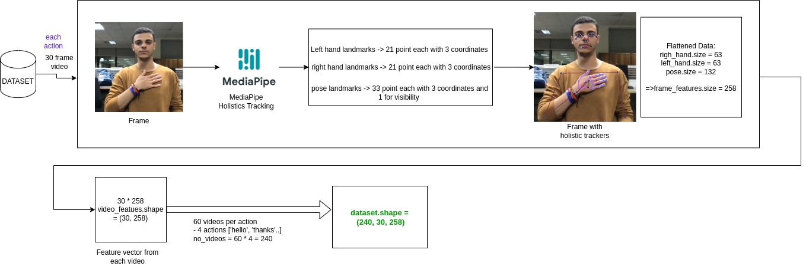
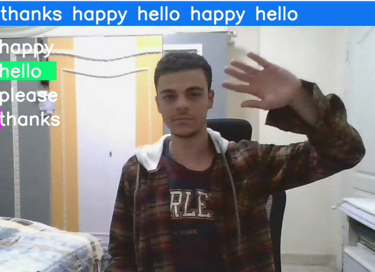

# Sign Language to speech using maching learning techniques

## Frameworks & liberaries used
### - MediaPipe by Google.
### - TensorFlow
### - Google Text To speech

## Dataset collection process




# project demonstration 👀

[](./README_imgs/voice_to_speech_demonstration.mp4)
### Packages Required

```bash
python3 -m pip install tensorflow opencv-python mediapipe sklearn matplotlib
```
#### For Text to voice
```bash
python3 -m pip install gtts
```

### To play resultant mp3 file from gtts
#### mpg123 is used in a linux machine
```bash
sudo apt update
sudo apt install mpg123
```

#### text to speech function implementation in linux 🐧
```python
processes = []

def text_to_speech(sentence):
    output = gTTS(sentence, lang='en', slow=False)
    output.save("output.mp3")
    process = subprocess.Popen("mpg123 output.mp3", shell=True)
    processes.append(process)

output = [p.wait() for p in processes]

```

#### text to speech function implementation in windows 🪟
NOTE ⚠️: in windows you don't need mpg123 to run .mp3 files in a windows machine
```python
processes = []

def text_to_speech(sentence):
    output = gTTS(sentence, lang='en', slow=False)
    output.save("output.mp3")
    process = subprocess.Popen("start output.mp3", shell=True)
    processes.append(process)

output = [p.wait() for p in processes]
```


### About mediapipe holistics

[Mediapipe holistics tracking](https://google.github.io/mediapipe/solutions/holistic.html)

### About tensorflow keras

[Tensorflow keras APIs](https://www.tensorflow.org/api_docs/python/tf/keras)

### About Google Text To Speech (gtts)

[Documentation of gtts](https://gtts.readthedocs.io/en/latest/)